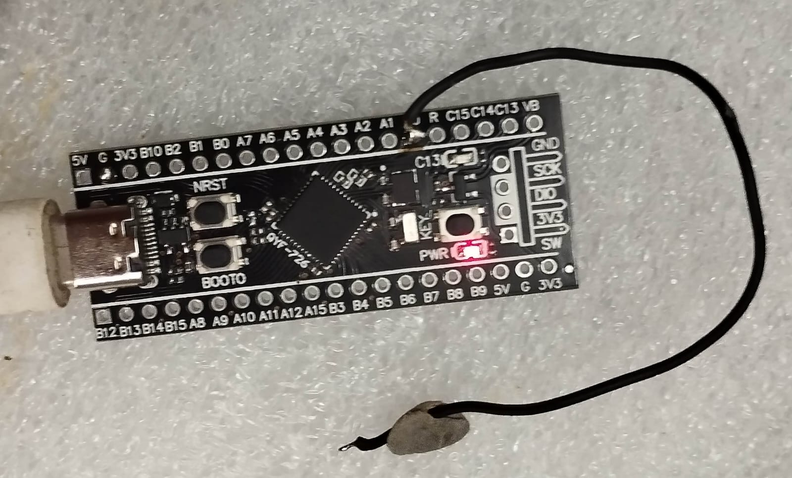
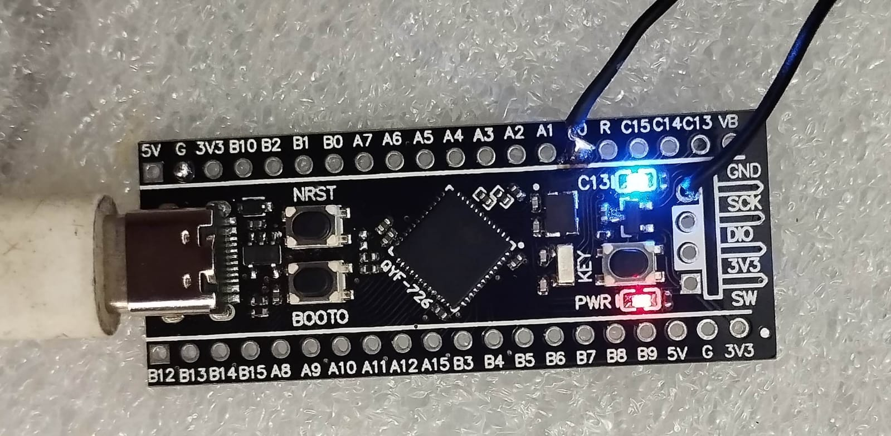

# 🔵 STM32 Bare-Metal LED + Button Control
### Black Pill · STM32F401CCU6 · No HAL · Direct Register Access


---

## 📌 Overview

Demonstrates GPIO input/output control on the **STM32F401CCU6 (Black Pill)** using bare-metal programming — direct register access without HAL or any abstraction libraries.

The onboard LED turns **ON** while an external button is held, and turns **OFF** when released (momentary behavior).

---

## ⚙️ Hardware

| Component | Details |
|-----------|---------|
| MCU | STM32F401CCU6 (Black Pill) |
| LED | Onboard LED (GPIO output) |
| Button | External push button (GPIO input) |

---

## 🛠️ Concepts Used

| Category | Concepts |
|----------|----------|
| Core | Register-level programming, RCC clock configuration |
| GPIO | Output (LED), Input (Button), Pull-up/Pull-down config |
| Techniques | Bit manipulation, GPIO input polling |

---

## 🚀 How It Works

1. **Enable GPIO clocks** — via the RCC register for both LED and button GPIO ports
2. **Configure LED pin** — set as push-pull output
3. **Configure Button pin** — set as input with internal pull-up resistor
4. **Poll button state** — continuously read the GPIO input data register (IDR)
5. **Drive LED** — LED turns ON while button is held, OFF when released

```
Button Held   →  GPIO IDR reads LOW  →  LED ON
Button Released  →  GPIO IDR reads HIGH  →  LED OFF
```

---

## 📂 Project Structure

```
├── main.c          # App logic — GPIO config, button polling, LED control
├── startup.s       # Reset handler, vector table, stack setup
├── linker.ld       # Memory layout — Flash and SRAM region mapping
└── images/
    ├── led_off.jpeg
    └── led_on.jpeg
```

---

## 📸 Output

> Onboard LED state controlled by external button press.

| LED OFF (Button Released) | LED ON (Button Held) |
|:-------------------------:|:--------------------:|
|  |  |

---

## 🎯 Learning Outcomes

- Configuring GPIO pins as both input and output
- Reading GPIO state via the Input Data Register (IDR)
- Understanding pull-up/pull-down resistor configuration
- Direct hardware control without HAL abstraction
- Fundamentals of embedded firmware development

---

## 👩‍💻 Author

**Swati Pathak**
